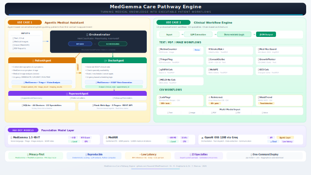
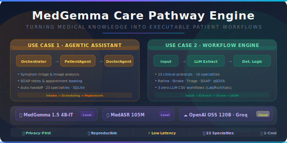

<!-- ═══════════════════════════════════════════════════════════════════════════
     MedGemma Clinical Workflow Engine — README
     ═══════════════════════════════════════════════════════════════════════════ -->

<div align="center">

# 🏥 MedGemma Clinical Workflow Engine

**A multi-agent medical assistant powered by MedGemma, MedASR & LiteLLM**

13 clinical workflows · 12 pre-built scenarios · voice dictation · image / PDF / CSV upload

[](#prerequisites)
[](#quick-start-step-by-step)
[](#license)

</div>

---

<!-- ═══════════════════════════════════════════════════════════════════════════
     ARCHITECTURE OVERVIEW — SVG diagram
     Shows the high-level data-flow: User ↔ Flask ↔ Agents / Workflows ↔ Models
     The SVG is stored at the repo root alongside its PNG fallback.
     ═══════════════════════════════════════════════════════════════════════════ -->

<div align="center">

### Architecture Overview



<br/>
<sub><i>Data-flow: User ↔ Flask UI ↔ Multi-Agent Orchestrator / Workflow Engine ↔ MedGemma · MedASR · Groq LLM</i></sub>

</div>

---

<!-- ═══════════════════════════════════════════════════════════════════════════
     DEMO VIDEO — MP4 walkthrough
     Full walkthrough showing scenarios, free chat, and workflow execution.
     The video file lives in video/medgemmachallenge_demo.mp4.
     GitHub renders <video> tags in README; for other hosts use the download link.
     ═══════════════════════════════════════════════════════════════════════════ -->

<div align="center">

### 🎬 Demo Video

<video src="video/medgemmachallenge_demo.mp4" controls width="800">
  Your browser does not support the video tag.
</video>

<br/>

> **Can't play the video above?** Download it directly:
> [`video/medgemmachallenge_demo.mp4`](video/medgemmachallenge_demo.mp4)

</div>

---

<!-- ═══════════════════════════════════════════════════════════════════════════
     WORKFLOW CARD THUMBNAIL — SVG card grid preview
     Visual preview of the 13 workflow cards as shown on the /workflows page.
     ═══════════════════════════════════════════════════════════════════════════ -->

<div align="center">

### Workflow Cards



</div>

---

## Table of Contents

- [Features](#features)
- [Prerequisites](#prerequisites)
- [Quick Start (Step by Step)](#quick-start-step-by-step)
  - [1 — Clone the Repository](#1--clone-the-repository)
  - [2 — Create a Python Environment](#2--create-a-python-environment)
  - [3 — Install Dependencies](#3--install-dependencies)
  - [4 — Install ffmpeg (for voice dictation)](#4--install-ffmpeg-for-voice-dictation)
  - [5 — Get API Keys](#5--get-api-keys)
  - [6 — Configure Environment Variables](#6--configure-environment-variables)
  - [7 — Download Model Weights (Optional)](#7--download-model-weights-optional)
  - [8 — Run the Application](#8--run-the-application)
  - [9 — Run Tests (Optional)](#9--run-tests-optional)
- [Usage Guide](#usage-guide)
- [Clinical Workflows](#clinical-workflows)
- [Project Structure](#project-structure)
- [API Reference](#api-reference)
- [Architecture Deep Dive](#architecture-deep-dive)
- [Environment Variables Reference](#environment-variables-reference)
- [Troubleshooting](#troubleshooting)
- [License](#license)

---

## Features

| Page | Route | Description |
|------|-------|-------------|
| **Scenarios** | `/` | 12 pre-built clinical scenarios (headache triage, chest X-ray, emergency, etc.) |
| **Free Chat** | `/chat` | Open-ended multi-turn medical conversation with image/PDF upload |
| **Workflows** | `/workflows` | 3×N grid of 13 protocol-adherent clinical workflows |

### Input Methods

| Method | Details |
|--------|---------|
| **Text** | Free-text clinical notes in the chat input |
| **Image** | Drag-and-drop or file picker (PNG, JPG, TIFF, WebP) — analyzed by MedGemma |
| **PDF** | Drag-and-drop; server extracts text via `pypdf` |
| **CSV** | Drag-and-drop or paste; supports flexible column names |
| **Voice** | Browser microphone → MedASR (Conformer-CTC, 105M params, 16 kHz mono) |

### Models Used

<!-- ─── This table describes the three AI models the system relies on ──────
     MedGemma and MedASR run LOCALLY — patient data never leaves the host.
     The Groq LLM is a cloud API used for orchestration only.
     MedGemma requires a GPU with ≥8 GB VRAM for quantized (NF4) inference.
     ──────────────────────────────────────────────────────────────────────── -->

| Model | Source | Size | Purpose | Runs On |
|-------|--------|------|---------|---------|
| **MedGemma 1.5 4B-IT** | `google/medgemma-1.5-4b-it` | ~4 GB | Vision-language medical analysis (triage, imaging, SOAP notes) | Local GPU (≥8 GB VRAM) |
| **MedASR** | `google/medasr` | ~400 MB | Medical speech-to-text (Conformer-CTC, 5 000 h training) | CPU or GPU |
| **GPT-OSS 120B** (via Groq) | `groq/openai/gpt-oss-120b` | Cloud API | Agent orchestration, tool-call dispatch, data extraction | Groq Cloud |

---

## Prerequisites

Before starting, make sure you have:

- **Python 3.11+** — [Download](https://www.python.org/downloads/)
- **Git** — [Download](https://git-scm.com/downloads)
- **A Groq API key** (free) — [Get one here](https://console.groq.com/keys)
- **A HuggingFace account + access token** — [Sign up](https://huggingface.co/join) · [Generate token](https://huggingface.co/settings/tokens)
- **GPU with ≥8 GB VRAM** (recommended) — for MedGemma vision inference. CPU-only works for everything else.
- **ffmpeg** (optional) — required only for voice dictation with non-WAV audio formats

---

## Quick Start (Step by Step)

### 1 — Clone the Repository

```bash
git clone https://github.com/YouvenZ/MedFlowAssit.git
cd MedFlowAssit
```

### 2 — Create a Python Environment

<!-- ─── Choose ONE of the methods below (conda OR venv) ────────────────────
     conda is recommended because it simplifies installing CUDA/PyTorch.
     venv is perfectly fine if you don't have conda installed.
     ──────────────────────────────────────────────────────────────────────── -->

**Option A — conda (recommended):**

```bash
conda create -n medgemma python=3.11 -y
conda activate medgemma
```

**Option B — venv:**

```bash
# Windows
python -m venv .venv
.venv\Scripts\activate

# macOS / Linux
python3 -m venv .venv
source .venv/bin/activate
```

### 3 — Install Dependencies

```bash
pip install -r requirements.txt
```

<!-- ─── What requirements.txt installs ─────────────────────────────────────
     Core:        flask, python-dotenv
     LLM:         litellm (routes calls to Groq / OpenAI / any provider)
     MedGemma:    transformers, torch, Pillow, bitsandbytes (NF4 quantization)
     MedASR:      numpy, pydub (WebM → WAV audio conversion)
     PDF:         pypdf (text extraction from uploaded PDFs)
     Testing:     colorama, huggingface-hub
     See requirements.txt for the full annotated dependency list.
     ──────────────────────────────────────────────────────────────────────── -->

> **Note (GPU users):** If you have an NVIDIA GPU with CUDA, install the GPU-enabled PyTorch **before** the above command:
> ```bash
> # Example for CUDA 12.1 — adjust for your CUDA version
> pip install torch torchvision --index-url https://download.pytorch.org/whl/cu121
> ```

### 4 — Install ffmpeg (for voice dictation)

<!-- ─── ffmpeg is needed by pydub to convert browser WebM audio to 16 kHz WAV
     which MedASR requires as input. If you don't plan to use the microphone
     button, you can safely skip this step.
     ──────────────────────────────────────────────────────────────────────── -->

> **Skip this step** if you don't need voice dictation.

```bash
# Windows (chocolatey)
choco install ffmpeg

# Windows (winget)
winget install ffmpeg

# macOS
brew install ffmpeg

# Ubuntu / Debian
sudo apt install ffmpeg
```

Verify installation:

```bash
ffmpeg -version
```

### 5 — Get API Keys

You need **two** keys/tokens:

#### a) Groq API Key (required)

<!-- ─── The Groq key powers the cloud LLM used for agentic orchestration,
     tool-call dispatch, and patient-facing conversation.
     The free tier has generous rate limits for development and demo use.
     ──────────────────────────────────────────────────────────────────────── -->

1. Go to [console.groq.com/keys](https://console.groq.com/keys)
2. Create a new API key
3. Copy it — it starts with `gsk_`

#### b) HuggingFace Token (required for MedGemma)

<!-- ─── MedGemma is a "gated" model on HuggingFace, meaning you must accept
     the license agreement before the weights can be downloaded.
     The HF_TOKEN authenticates your download request.
     ──────────────────────────────────────────────────────────────────────── -->

1. Create an account at [huggingface.co/join](https://huggingface.co/join)
2. Go to [huggingface.co/google/medgemma-1.5-4b-it](https://huggingface.co/google/medgemma-1.5-4b-it) and **accept the model license**
3. Generate a token at [huggingface.co/settings/tokens](https://huggingface.co/settings/tokens) (read access is sufficient)
4. Copy the token — it starts with `hf_`

### 6 — Configure Environment Variables

<!-- ─── The .env file stores secrets locally and is loaded by python-dotenv
     at startup. NEVER commit your real .env file to git.
     The .env.example file is a safe, annotated template you can copy.
     ──────────────────────────────────────────────────────────────────────── -->

Copy the example template and fill in your keys:

```bash
# Linux / macOS
cp .env.example .env

# Windows (Command Prompt)
copy .env.example .env

# Windows (PowerShell)
Copy-Item .env.example .env
```

Open `.env` in your editor and set the **required** values:

```env
# ─── REQUIRED ─────────────────────────────────────────────────────────
# Groq API key — powers the cloud LLM for orchestration & extraction
GROQ_API_KEY=gsk_your_actual_key_here

# HuggingFace token — needed to download gated MedGemma model weights
HF_TOKEN=hf_your_actual_token_here

# ─── OPTIONAL (defaults are fine for most users) ─────────────────────
# MEDASR_MODEL=google/medasr       # Override MedASR model ID
# MEDASR_DEVICE=cpu                # Set to "cuda" for GPU-accelerated ASR
```

> **Full reference:** See [`.env.example`](.env.example) for the complete annotated template with explanations for every variable.

### 7 — Download Model Weights (Optional)

<!-- ─── Pre-downloading is useful for offline / air-gapped environments
     or to avoid a long wait on your first API request.
     If you skip this, models download automatically on first use.
     Weights are cached in ~/.cache/huggingface/ and only download once.
     ──────────────────────────────────────────────────────────────────────── -->

Pre-download models so the first request isn't slow:

```bash
python download_and_test.py --download-only
```

| Model | Download Size | Cache Location |
|-------|--------------|----------------|
| MedGemma 1.5 4B-IT | ~4 GB | `~/.cache/huggingface/` |
| MedASR | ~400 MB | `~/.cache/huggingface/` |

> **Skip this?** Models auto-download on first use. This step just avoids a wait during your first request.

### 8 — Run the Application

```bash
python app.py
```

Open your browser to **http://localhost:5000** and you should see the Scenarios page.

| Page | URL | What it does |
|------|-----|-------------|
| Scenarios | [localhost:5000/](http://localhost:5000/) | 12 pre-built clinical scenarios |
| Free Chat | [localhost:5000/chat](http://localhost:5000/chat) | Open medical chat with uploads |
| Workflows | [localhost:5000/workflows](http://localhost:5000/workflows) | 13-card clinical workflow grid |

**Alternative — CLI mode** (terminal-based, no browser needed):

```bash
python main.py                          # Interactive REPL (default)
python main.py demo                     # Run all 12 scenarios end-to-end
python main.py scenario 3               # Run a single scenario by number
python main.py --model groq/llama-3.3-70b-versatile interactive  # Custom model
```

### 9 — Run Tests (Optional)

<!-- ─── The test script validates the LLM connection, all API endpoints,
     and all 13 workflow executions. The Flask app must be running on
     localhost:5000 for API tests — start it in a separate terminal first.
     ──────────────────────────────────────────────────────────────────────── -->

Start the app first (`python app.py`), then in a **separate terminal**:

```bash
# Full test suite: models + LLM + endpoints + workflows
python download_and_test.py --test-all

# Individual test modes:
python download_and_test.py --download-only      # Pre-download HF models only
python download_and_test.py --test-llm           # Test Groq LLM API connection
python download_and_test.py --test-api           # Test all Flask API endpoints
python download_and_test.py --test-workflows     # Test all 13 workflow executions
```

---

## Usage Guide

### Scenario Mode (recommended for first-time users)

1. Open [localhost:5000](http://localhost:5000/)
2. Click any scenario card (e.g. **"Headache + triage"**)
3. The system auto-sends pre-built patient messages
4. Watch the multi-agent pipeline: intake → triage → clinical note → booking

### Free Chat Mode

1. Open [localhost:5000/chat](http://localhost:5000/chat)
2. Type symptoms, drag-and-drop images, upload PDFs, or click the 🎤 microphone button
3. The agent collects information, triages via MedGemma, and guides through scheduling

### Workflow Mode

1. Open [localhost:5000/workflows](http://localhost:5000/workflows)
2. Click any workflow card (e.g. **"StrokeRisk+"**)
3. Enter clinical text, upload a PDF/image, or paste CSV data
4. Click **Run** — the result appears as a structured clinical report with scores and metrics

---

## Clinical Workflows

### Text / PDF / Image — Medicine Rules & Scoring

| # | Workflow | Specialty | Protocol | Input | Description |
|---|----------|-----------|----------|-------|-------------|
| 1 | **RetinaCounter** | Ophthalmology | ICDR Scale | Image | Diabetic retinopathy grading from fundus images |
| 2 | **StrokeRisk+** | Cardiology | CHA₂DS₂-VASc | Text, PDF | 7-factor stroke risk calculator |
| 3 | **Med-Rec Guard** | Geriatrics | AGS Beers 2023 | Image, Text, PDF | Medication reconciliation against Beers Criteria |
| 4 | **TriageFlag** | Radiology | ACR Actionable | Text, PDF | Critical finding triage — 3-level urgency |
| 5 | **GrowthPlotter** | Pediatrics | CDC/WHO Charts | Text | Growth percentile calculator (BMI, weight, height) |
| 6 | **ConsultScribe** | General Practice | SOAP + ICD-10 | Text | SOAP note generator with ICD-10 coding |
| 7 | **qSOFA Calc** | Emergency Medicine | qSOFA (Sepsis-3) | Text, PDF | Quick SOFA sepsis screening — 3 bedside criteria |
| 8 | **WellsPE** | Pulmonology | Wells Criteria | Text, PDF | Pulmonary embolism probability — 7-item rule |
| 9 | **MELD-Na Calc** | Hepatology | MELD-Na (UNOS 2016) | Text, PDF | Liver disease severity & transplant priority |
| 10 | **GCS Calc** | Neurology | Glasgow Coma Scale | Text, PDF | E+V+M neurological assessment with TBI grade |

### CSV-Based — Tabular Healthcare Data

| # | Workflow | Specialty | Protocol | Input | Description |
|---|----------|-----------|----------|-------|-------------|
| 11 | **LabFlagr** | Pathology / Lab | Reference Ranges | CSV | Flag abnormals, critical values, compute eGFR / anion gap |
| 12 | **RxInteract** | Pharmacy | Drug Interaction DB | CSV | Pairwise drug-drug interaction check (HIGH/MODERATE/LOW) |
| 13 | **VitalsTrend** | ICU / Nursing | NEWS2 (RCP) | CSV | Serial vitals → NEWS2 scoring + deterioration trends |

<!-- ─── All workflows follow a chain-based (NOT agentic) architecture.
     The LLM only extracts structured variables from free text; all clinical
     scoring is performed by deterministic Python logic using published formulae.
     This guarantees reproducibility — identical inputs always yield identical scores.
     CSV workflows (#11-13) use ZERO LLM calls and are purely algorithmic.
     ──────────────────────────────────────────────────────────────────────── -->

**Architecture:** Every workflow follows a **chain-based** (non-agentic) pattern:

```
Input → LLM Extraction / CSV Parse → Deterministic Python Logic → Structured JSON Output
```

---

## Project Structure

<!-- ─── The project is organized into logical sections:
     Entry points, Agent system, AI models, Domain logic, Workflows, Frontend, Assets.
     Each file has a single responsibility.
     ──────────────────────────────────────────────────────────────────────── -->

```
MedFlowAssit/
│
├── .env.example              # ← Environment variable template (copy to .env)
├── .env                      # ← Your local secrets (git-ignored — never commit!)
├── requirements.txt          # Python dependencies (annotated by category)
│
│   ── Entry Points ────────────────────────────────────────────────────────
├── app.py                    # Flask web application — all routes & UI pages
├── main.py                   # CLI entry point (interactive REPL / demo / scenario)
│
│   ── Agent System ────────────────────────────────────────────────────────
├── base_agent.py             # Abstract BaseAgent — reusable tool-calling loop
├── medical_agent.py          # MedicalAppointmentAgent — top-level facade
├── orchestrator.py           # Multi-agent orchestrator (patient ↔ doctor handoff)
├── patient_agent.py          # PatientAgent — demographics, symptoms, image upload
├── doctor_agent.py           # DoctorAgent — triage, SOAP notes, scheduling
├── paperwork_agent.py        # PaperworkAgent — summaries, referrals, reminders
│
│   ── AI Model Clients ────────────────────────────────────────────────────
├── llm_config.py             # LiteLLM wrapper — llm_completion(), DEFAULT_MODEL
├── medgemma_client.py        # MedGemma vision-language pipeline (4B-IT, NF4 quant)
├── medasr.py                 # MedASR speech-to-text (Conformer-CTC, lazy singleton)
│
│   ── Domain Logic ────────────────────────────────────────────────────────
├── specialty.py              # Specialty enum + 23 specialty system prompts
├── db.py                     # SQLite DB (44 doctors, 22 specialties, time slots)
├── pdf_extract.py            # PDF text extraction (pypdf / PyPDF2 / pdfplumber)
│
│   ── Utilities ───────────────────────────────────────────────────────────
├── download_and_test.py      # Model downloader + full endpoint/workflow test suite
│
│   ── Workflow Engine (13 clinical workflows) ─────────────────────────────
├── workflows/
│   ├── __init__.py           # Workflow registry (get_all_cards, run_workflow)
│   ├── base.py               # ClinicalWorkflow ABC, WorkflowResult, InputType
│   ├── retina_counter.py     # ICDR diabetic retinopathy grading
│   ├── stroke_risk.py        # CHA₂DS₂-VASc stroke risk calculator
│   ├── medrec_guard.py       # AGS Beers Criteria medication reconciliation
│   ├── triage_flag.py        # ACR critical finding triage
│   ├── growth_plotter.py     # CDC/WHO growth percentile calculator
│   ├── consult_scribe.py     # SOAP note + ICD-10 generator
│   ├── qsofa_calc.py         # qSOFA sepsis screening (Sepsis-3)
│   ├── wells_pe.py           # Wells criteria for pulmonary embolism
│   ├── meld_calc.py          # MELD-Na liver disease score (UNOS 2016)
│   ├── gcs_calc.py           # Glasgow Coma Scale (E+V+M)
│   ├── lab_flagr.py          # CSV lab panel analyzer (100+ reference ranges)
│   ├── rx_interact.py        # CSV drug interaction checker (40+ pairs)
│   └── vitals_trend.py       # CSV vitals trend + NEWS2 scoring
│
│   ── Frontend ────────────────────────────────────────────────────────────
├── templates/
│   ├── index.html            # Scenarios page (/)
│   ├── chat.html             # Free Chat page (/chat)
│   └── workflows.html        # Workflow Grid (/workflows)
├── static/
│   └── style.css             # All CSS styles
│
│   ── Assets & Media ──────────────────────────────────────────────────────
├── architecture_overview.svg # System architecture diagram (SVG)
├── architecture_overview.png # Architecture diagram (PNG fallback)
├── card_thumbnail.svg        # Workflow card grid preview (SVG)
├── card_thumbnail.png        # Workflow card preview (PNG fallback)
├── video/
│   └── medgemmachallenge_demo.mp4  # Full demo walkthrough video
│
├── uploads/                  # Temporary upload directory (auto-created at runtime)
├── writeup.md                # Detailed project writeup / paper
└── README.md                 # ← You are here
```

---

## API Reference

### Pages

| Method | Route | Description |
|--------|-------|-------------|
| `GET` | `/` | Scenarios page |
| `GET` | `/chat` | Free Chat page |
| `GET` | `/workflows` | Workflow Grid Interface |

### Agent / Chat Endpoints

| Method | Endpoint | Description |
|--------|----------|-------------|
| `POST` | `/api/chat` | Send a message to the medical agent |
| `POST` | `/api/reset` | Reset the agent session |
| `GET` | `/api/status` | Current agent state & phase |
| `POST` | `/api/scenario/<num>` | Start a pre-built scenario (1–12) |
| `POST` | `/api/paperwork` | Generate clinical documentation for current session |

### Workflow Endpoints

| Method | Endpoint | Description |
|--------|----------|-------------|
| `GET` | `/api/workflows` | List all 13 workflow cards (metadata) |
| `POST` | `/api/workflows/run` | Execute a workflow by `workflow_id` |

**Example — text workflow request:**

```json
{
  "workflow_id": "stroke_risk",
  "text": "72-year-old male with atrial fibrillation, hypertension, diabetes…"
}
```

**Example — CSV workflow request:**

```json
{
  "workflow_id": "lab_flagr",
  "csv_text": "test,value,unit\nHemoglobin,8.5,g/dL\nWBC,15.2,×10³/µL\nPotassium,6.1,mEq/L"
}
```

**Standard response schema (all workflows):**

```json
{
  "workflow_id": "stroke_risk",
  "status": "success",
  "data": {
    "summary": "CHA₂DS₂-VASc Score: 4/9. Estimated annual stroke risk: 4.8%.",
    "metrics": { "score": "4/9", "annual_stroke_risk": "4.8%" },
    "protocol_adherence": true,
    "raw_output": "═══ CHA₂DS₂-VASc STROKE RISK REPORT ═══\n..."
  },
  "artifacts": []
}
```

### Upload & Transcription Endpoints

| Method | Endpoint | Description |
|--------|----------|-------------|
| `POST` | `/api/upload/image` | Upload image → base64 data-URI |
| `POST` | `/api/upload/pdf` | Upload PDF → extracted text |
| `POST` | `/api/upload/csv` | Upload CSV → raw text content |
| `POST` | `/api/transcribe` | Audio → MedASR transcription (file or base64 JSON) |
| `GET` | `/api/medasr/status` | Check MedASR model availability |

---

## Architecture Deep Dive

### Multi-Agent System (Scenarios & Chat)

<!-- ─── The Orchestrator uses keyword-scoring intent classification to route
     messages between PatientAgent (intake phase) and DoctorAgent (scheduling).
     Each agent extends BaseAgent, which implements a reusable tool-calling loop:
     the LLM receives tool schemas → invokes functions → receives results →
     iterates up to 12 rounds until producing a final text response.
     The handoff from PatientAgent to DoctorAgent is automatic: once the
     orchestrator detects that intake is complete, it transfers structured
     patient data (demographics, symptoms, triage result) to the DoctorAgent.
     ──────────────────────────────────────────────────────────────────────── -->

```
User
 │
 ▼
Orchestrator ──→ PatientAgent  (intake: demographics, symptoms, image upload)
 │                  │
 │                  ├──→ MedGemma  (symptom triage, image analysis)
 │                  └──→ MedASR   (voice dictation → text)
 │
 │  ──── automatic handoff when intake is complete ────
 │
 ├──────→ DoctorAgent   (clinical note via MedGemma, scheduling via SQLite DB)
 │
 └──────→ PaperworkAgent (appointment summaries, referral letters, reminders)
```

### Workflow Engine (deterministic chains)

<!-- ─── Workflows are NOT agentic. They follow a strict 2-step chain:
     1. LLM extracts structured variables (or CSV is parsed directly)
     2. Deterministic Python logic applies published clinical formulae
     This ensures reproducibility — same input always gives same score.
     ──────────────────────────────────────────────────────────────────────── -->

```
UI Card click → POST /api/workflows/run
             → WorkflowRegistry.run_workflow(id, data)
             → ClinicalWorkflow.run()
                 ├── validate_input()       # Check required fields & input type
                 ├── execute()
                 │     ├── Step 1: LLM extraction OR CSV parse
                 │     └── Step 2: Deterministic Python logic (published formulae)
                 └── WorkflowResult         # Standard JSON output schema
```

### Database

<!-- ─── SQLite is used for scheduling (doctors, time slots, appointments).
     The DB file (medical_appointments.db) auto-creates on first run
     with seed data: 44 doctors across 22 specialties, 14 days of time slots.
     If you encounter database issues, simply delete the .db file and restart.
     ──────────────────────────────────────────────────────────────────────── -->

The SQLite database (`medical_appointments.db`) is **auto-created on first run** with:
- **44 doctors** across 22 medical specialties
- **14 days** of appointment time slots per doctor
- Full lifecycle: booking → retrieval → rescheduling → cancellation

---

## Environment Variables Reference

<!-- ─── Complete reference of every environment variable the app reads.
     Only GROQ_API_KEY is strictly required to start the app.
     HF_TOKEN is required specifically for downloading MedGemma weights.
     All other variables have sensible defaults.
     See .env.example for a copy-paste template with inline comments.
     ──────────────────────────────────────────────────────────────────────── -->

| Variable | Required | Default | Description |
|----------|----------|---------|-------------|
| `GROQ_API_KEY` | **Yes** | — | Groq API key for the cloud LLM ([get one](https://console.groq.com/keys)) |
| `HF_TOKEN` | **Yes**\* | — | HuggingFace access token for gated model downloads ([get one](https://huggingface.co/settings/tokens)) |
| `MEDASR_MODEL` | No | `google/medasr` | HuggingFace model ID for MedASR speech-to-text |
| `MEDASR_DEVICE` | No | `cpu` | Torch device for MedASR inference (`cpu` or `cuda`) |
| `FLASK_SECRET_KEY` | No | hardcoded demo key | Flask session cookie signing key (change in production!) |
| `FLASK_DEBUG` | No | `0` | Set to `1` for Flask auto-reload during development |
| `TEST_BASE_URL` | No | `http://localhost:5000` | Base URL used by the test script |

\* `HF_TOKEN` is required only when using MedGemma vision features (gated model). Not needed for text-only or CSV workflows.

---

## Troubleshooting

<!-- ─── Common issues encountered during setup and their solutions ──────── -->

| Problem | Solution |
|---------|----------|
| `GROQ_API_KEY not set` error | Ensure `.env` exists in the project root and contains `GROQ_API_KEY=gsk_...` |
| `401 Unauthorized` from HuggingFace | Accept the MedGemma license at [the model page](https://huggingface.co/google/medgemma-1.5-4b-it) and verify `HF_TOKEN` in `.env` |
| `CUDA out of memory` | MedGemma needs ≥8 GB VRAM. Close other GPU apps, or set quantization to INT8/CPU |
| `ffmpeg not found` | Install ffmpeg ([Step 4](#4--install-ffmpeg-for-voice-dictation)) or skip voice dictation |
| `pydub.exceptions.CouldntDecodeError` | ffmpeg is missing from PATH — reinstall or add its bin directory to system PATH |
| MedASR download hangs | Check internet; model is ~400 MB. Pre-download with `python download_and_test.py --download-only` |
| `ModuleNotFoundError: bitsandbytes` | Run `pip install bitsandbytes`. Windows users: `pip install bitsandbytes-windows` |
| Database errors | Delete `medical_appointments.db` and restart — it auto-recreates with seed data |
| Workflows return `"status": "error"` | Check terminal logs for the full traceback. Common causes: missing input fields or malformed CSV |
| `torch not compiled with CUDA` | Install the CUDA-enabled PyTorch build matching your CUDA version ([pytorch.org](https://pytorch.org/get-started/locally/)) |

---

## License

This project is for **educational and research purposes**.

---

<div align="center">

**Source:** [github.com/YouvenZ/MedFlowAssit](https://github.com/YouvenZ/MedFlowAssit)

Built by **Dr. Rachid Zeghlache** & **Dr. Yassine Mamou**

</div>
